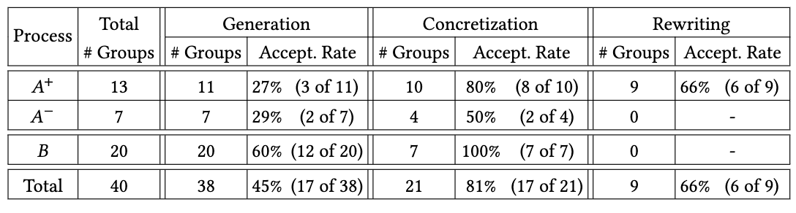
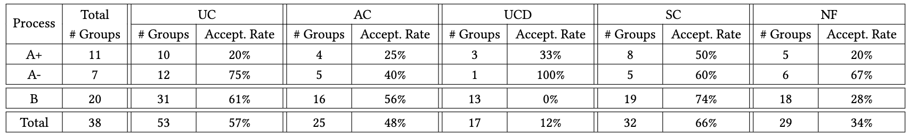
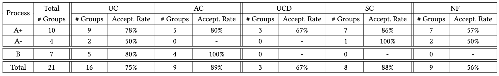
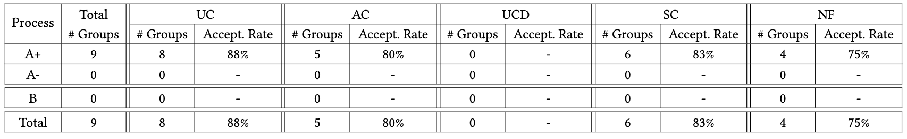

### Student reflections on using ChatGPT
We provide here the most prominent observations reported by the students in their own reflection on using ChatGPT for the requirement engineering task.
For each reported observation, we show the number of groups (out of 20) that mentioned that observation in their reflections.

### Advantages and Disadvantages

    

        <h3>Advantages</h3>
        
    

    

        <h3>Disadvantages</h3>
        
    

---

### ChatGPT Usage Patterns

We identified three main modes of ChatGPT usage among students. Table below shows the distribution of different types of usage patterns across different processes: 𝐴+, 𝐴−, and 𝐵.

Each usage mode can be applied to one or more components of the requirements specification: use cases (UC), actors (AC), use case diagram (UCD), success/failure scenarios (SC), and non-functional requirements (NF). We further illustrate the distribution of these components for each usage pattern within each process. 

### Generation

### Concretization

### Rewriting
