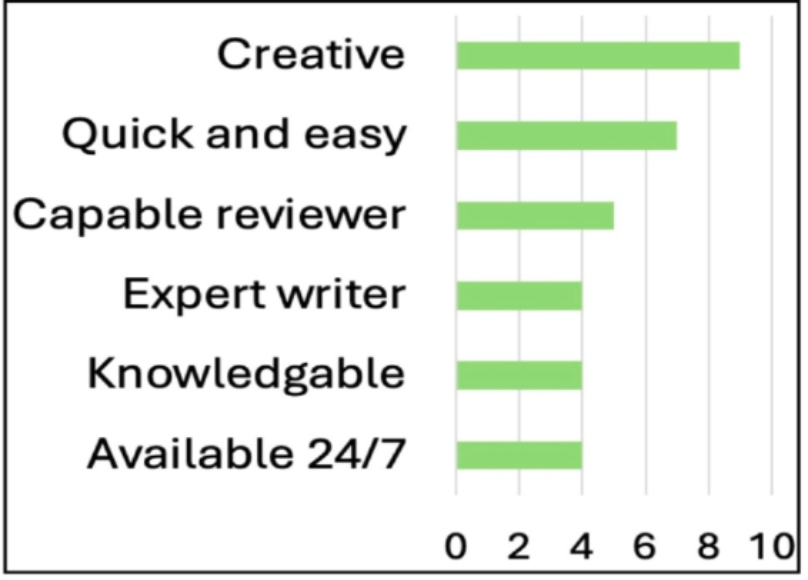
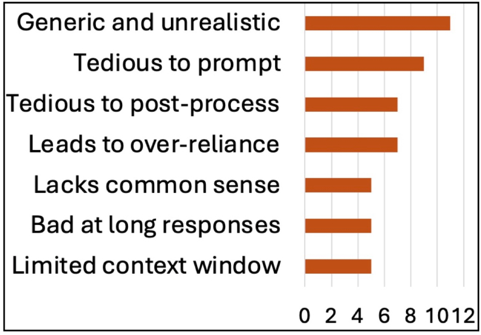

### Student reflections on using ChatGPT
We provide here the most prominent observations reported by the students in their own reflection on using ChatGPT for the requirement engineering task.
For each reported observation, we show the number of groups (out of 20) that mentioned that observation in their reflections.

### Advantages

### Disadvantages
