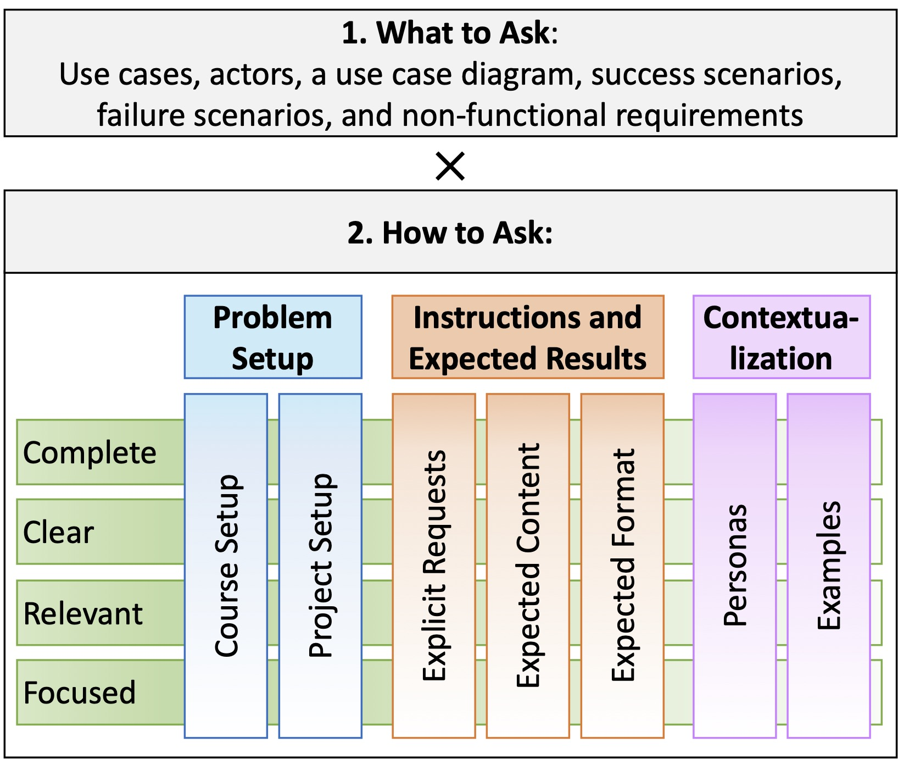

This page provides a detailed outline of our requirements and prompt assessment rubric. All artifacts produced by students in the course, i.e., requirements
specifications (HA, GA, GB, FA and FB) and ChatGPT prompts (PA and PB) were manually graded by two authors of this paper, who were also in the teaching staff of the course.
The graders cross-validated their marks and all disagreement (5% for requirements and 6% for prompts) were resolved with a third author, who was the course instructor.

### Requirements Quality Attributes:

- **Complete** and cover all parts of the project goals, providing sufficient information to implement the system
    - When something is part of the project descriptions and goals, there should be a use case for it. E.g., “Adding a friend can be done in one click”. What about other parts of the use case / other use cases
    - Cover the course required requirements: 5-6 non-trivial requirements and 4 components: live updates, external API, complex logic, and external authentication service.
- **Consistent,** without having contradictory definitions across multiple requirements.
    - E.g., should not use different words for the same use case, failure scenarios should correspond to concrete steps in success scenarios
- **Unambiguous,** i.e., free of multiple, potentially conflicting interpretations of a requirement.
- **Focused,** i.e., defined at the right level of detail (not too coarse-grained or too fine-grained).
    - E.g., “add profile item”, “update profile item”, “delete profile item” are too fine-grained for an ecommerce application. It can be “manage profile”. Not every button click deserves to be a separate use case
- **Relevant** to the project at hand rather than applicable to any project
    - E.g., “response time under 1 sec” should explain why 1 sec is applicable for this project (and not 3 or 0.5).
- **Feasible** to implement given the time/resource constraints.
    - E.g., “the server should be available 24/7”
- **Verifiable/Measurable,** i.e., where it is possible to clearly define corresponding test cases.
    - E.g., “it should perform well” is not measurable
- **Correctly classified:** functional requirements describe functionality that helps meet the needs of its users and stakeholders; Non-functional requirements specify criteria related to system qualities such as performance, reliability, security, and usability
    - E.g., specifying the performance criteria the system must meet, such as response times or throughput is not a functional requirement
    - “User should be able to log-in” is a functional rather than security requirement
- **Well-formatted,** with appropriate notations of use case diagram, success and failure scenarios, etc.

---

### Prompts Quality Attributes:

<!--  -->

---

### Assessment Methodology

Both artifacts (requirements specifications and ChatGPT prompts) were assessed using a similar methodology. Our complete rubric is linked below: 

- ##### [Grading Rubric](data/RequirementsandPromptRubric.xlsx).

The file includes four tabs, "Course-defined Req. Components", "Requirements Rubric", “Prompt Rubric - How to Ask (H)” and "Prompt Rubric - What to Ask (W)”. 

The first tab lists six requirements specification components defined in the course: actors, use cases, use case diagram, success scenarios, failure scenarios, and non-functional requirements. 

The second tab corresponds to requirements quality attributes. 
Each super-row presents a specific quality attribute,
and each row inside the super-row lists concrete issues, such as missing or incomplete descriptions, logical or factual errors, and more, identified during artifact evaluation.
Each issue is assigned a severity level from 0 – absent, to 1 – rare, 2 – moderate, 3 – abundant. Severity ranks are then added and normalized for each attribute,
translated into a 0-5 scale attribute score (the higher is the
better), based on the conversion criteria provided in the "Conversion" column. 
Finally, the scores from different attributes are aggregated as the weighted average of attribute scores.
The weights used for each attribute are presented in the column "Weight".

The third tab corresponds to the "How to Ask" prompt quality attributes. 
As with requirements, when grading, a set of issues was identified for each of the 28 factors (7 attributes × 4 cross-cutting qualities),
assessed by severity, and converted into a numeric score on 0 to 5 scale (the higher is the better). These scores were then averaged across categories to produce an overall score for the "How to Ask" (denoted by H).
The fourth tab reflects the "What to Ask" prompt quality attributes. For this evaluation, chats were checked for the presence of at least one request or question related to each of the six requirements components. The resulting score presents the fraction of requirements components students consulted the ChatGPT about.