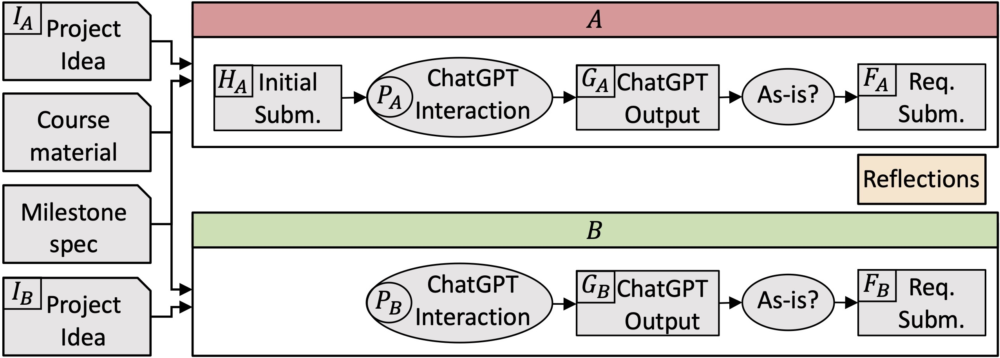

### Requirement Engineering Milestone Summaries

The purpose of this page is to first explain the overall process of using ChatGPT in the requirement engineering process of this course. Next we specify the information required from students to define the project proposal (section A) as well as the initial (section B) and final (section C) requirement specifications.

---

### Explanation of the Process:

In an effort to embrace and utilize these advanced AI tools, students were allowed to use them throughout the course. In fact, one of the educational objectives of this course was to expose students to the advantages and disadvantages of using AI tools in SE processes. As such, throughout the course, students systematically used such tools as assistants in completing their assignments and were required to document and critically analyze these uses, identifying strengths and weaknesses of the AI tools. The analysis was submitted together with the assignments.  

For the requirements milestone, students were instructed to use ChatGPT version 3.5 (other versions and tools were forbidden, for fairness). To allow students to explore and critically analyze the capabilities of conversational AI, we designed two distinct processes, A and B, of using ChatGPT
to produce requirements specifications, as shown in Figure above. 

The students were first asked to come up, as a group, with two possible ideas for a project they might want to implement in the scope of the course. We randomly split the 20 project groups into two groups of ten and labeled the first idea in the submissions of the first group and the second idea in the submissions of the second group as idea A (IA). The remaining ideas were labeled as idea B (IB). 
This was done to avoid any bias that may arise from personal preferences of students
when picking which idea to work on first.

Next, in the course lab session, the students spent one and a half hours producing requirements specifications for IA (as was typically done in previous offerings of the course, before conversational AI technologies were introduced). Use of any external tools was not permitted in this session, but TAs were available to answer questions, in case students had any. The student were asked to submit the produced version. However, this intermediate submission was not graded in the scope of the course (we later graded it for this study).

Next, students were asked to use ChatGPT to further improve HA through a series of discussions. They had to submit all their conversations with ChatGPT, which we refer to as PA. Students could choose to stop interacting with ChatGPT at any point of this step, if they believed the interactions do not lead to any meaningful improvement. We refer to the requirements specifications we extracted from these conversations as GA. This artifact was not graded in the scope of the course, but we later graded it in the scope of this study.

As the last step in this process, students were asked to produce and submit their final requirement specification for idea A, which we refer to as A. We also asked them whether they used ChatGPT output as is and, if not, what they had to refine and why.

Finally, students repeated the process from idea B (lower part of Figure above). Unlike in process A, they interacted with ChatGPT immediately, without a preliminary session to produce their requirements specifications. We refer to artifacts produced in this process as PB (for ChatGPT conversations), GB (for the requirement specializations produced through this interaction), and B (for the final submission of requirements specifications of idea B, which was graded in the scope of the course).

---

### [A. Project Proposal Assignment to Produce "Project Idea (I)"] (data/M1_Project_Ideas.pdf) 

---
### [B. Initial Requirements Lab Activity to Produce "Initial Submission (H)"] (data/M2A_Requirements.pdf)

---
### [C. Final Requirement Specification Assignment to Produce "Final submission (F)"] (data/M2B_Requirements.pdf)

 
