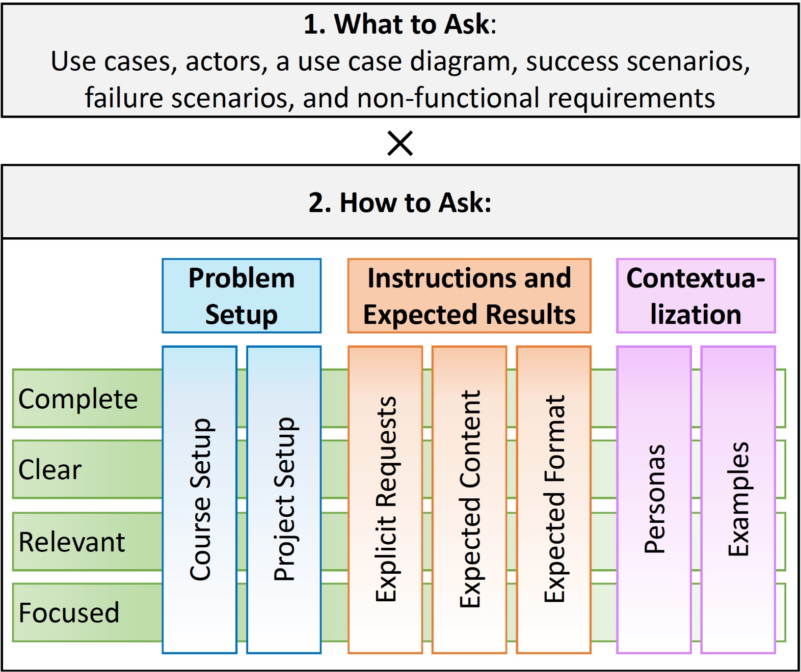

### Prompt Quality Metric:

---

### Prompt Quality Grading: 
All artifacts produced by students in the course, i.e., prompts (PA and PB), were manually graded by two authors of this paper, who were also in the teaching staff of the course. We assigned 0-5 scale for the quality attributes of the metric. The score of 5 means “fully satisfactory”, 4 means “mostly satisfactory but minor details missing”, 3 means “mostly satisfactory but moderate-level of details missing”, 2 means “major details missing”, 1 means “minimal attempt”, and 0 means “fully unsatisfactory”. The graders cross-validated their marks and all disagreement (6% disagreement rate) were resolved with a third author, who was also involved in course instruction.